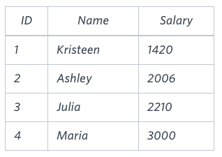

#Problem 1

Query the two cities in STATION with the shortest and longest CITY names, as well as their respective lengths (i.e.: number of characters in the name). If there is more than one smallest or largest city, choose the one that comes first when ordered alphabetically.
The STATION table is described as follows:


where LAT_N is the northern latitude and LONG_W is the western longitude.

Sample Input

For example, CITY has four entries: DEF, ABC, PQRS and WXY.

Sample Output

ABC 3
PQRS 4
Explanation

When ordered alphabetically, the CITY names are listed as ABC, DEF, PQRS, and WXY, with lengths  and . The longest name is PQRS, but there are  options for shortest named city. Choose ABC, because it comes first alphabetically.

Note
You can write two separate queries to get the desired output. It need not be a single query.

##  Possible Solution

This is not highly optimized.

```sql
create temporary table TestDB(
    city varchar(21),
    city_length integer
);
insert into TestDB(city)
select 
    city
from 
    Station 
;
update TestDB 
set
    city_length = length(city)
;
Alter table TestDB order by
    city_length asc,
    city asc
;
set @MinVal := 0, @MaxVal :=0;
set @MinCities :='', @MaxCities := '';
select Min(city_length) into @MinVal from TestDB;
select Max(city_length) into @MaxVal from TestDB;
select city into @MinCities from TestDB where city_length = @MinVal Limit 1;
select city  into @MaxCities from TestDB where city_length = @MaxVal Limit 1;
select @MinCities, @MinVal;
select @MaxCities, @MaxVal;
```

#  Using Case Statement
Write a query identifying the type of each record in the TRIANGLES table using its three side lengths. Output one of the following statements for each record in the table:

Equilateral: It's a triangle with  sides of equal length.

Isosceles: It's a triangle with  sides of equal length.

Scalene: It's a triangle with  sides of differing lengths.

Not A Triangle: The given values of A, B, and C don't form a triangle.

### Input Format

The TRIANGLES table is described as follows:


### Sample Input
Each row in the table denotes the lengths of each of a triangle's three sides.


### Sample Output

Isosceles

Equilateral

Scalene

Not A Triangle

*NOTE:* The code explains the output type information.

##  Possible Solution

This is not highly optimized.

```sql
create temporary table TestDB(
    A integer,
    B integer,
    C integer,
    triangle_type varchar(20)
);
insert into TestDB(A, B, C)
select 
    A, B, C
from 
    Triangles
;
update TestDB 
set
    triangle_type = Case
        when (A + B <= C) or (B+C <= A) or (C+A <= B) then "Not A Triangle"
        when (A = B) and (B = C) then "Equilateral"
        when (A <> B) and (B<>C) and (A <> C) then "Scalene"
        else "Isosceles"
    end;
;

select triangle_type from TestDB
```

# Blunder using Conversion of columns

amantha was tasked with calculating the average monthly salaries for all employees in the EMPLOYEES table, but did not realize her keyboard's  key was broken until after completing the calculation. She wants your help finding the difference between her miscalculation (using salaries with any zeros removed), and the actual average salary.

Write a query calculating the amount of error (i.e.:  average monthly salaries), and round it up to the next integer.

## Input Format

The EMPLOYEES table is described as follows:


Note: Salary is per month.

## Sample Input



## Sample Output

2061

##Explanation

The table below shows the salaries without zeros as they were entered by Samantha:


Samantha computes an average salary of . The actual average salary is .

The resulting error between the two calculations is . Since it is equal to the integer , it does not get rounded up.

##  Possible Solution

This is not highly optimized

```sql
create temporary table TestDB(
    trueVal integer,
    errorVal integer
);
insert into TestDB(trueVal, errorVal)
select 
    salary, salary
from 
    Employees
where (salary > 1000) and (salary < 100000)
;
alter table TestDB change errorVal errorVal varchar(20);
update TestDB
    set errorVal = replace(errorVal, '0', '')
;
alter table TestDB change errorVal errorVal integer;
#Now compute the value
set @actual = 0., @mis = 0.;
select avg(trueVal) into @actual from TestDB;
select avg(errorVal) into @mis from TestDB;

select ceil(@actual - @mis)
```

```sql
create temporary table TestDB(
    months integer,
    salary integer,
    total_earn integer
);
insert into TestDB(months, salary)
select 
    months, salary
from 
    Employee
;
update TestDB 
set
    total_earn = months * salary
;
set @max_earn = 0, @number_max = 0;
select max(total_earn) into @max_earn from TestDB;
select count(total_earn) into @number_max from TestDB where total_earn = @max_earn;
select @total_earn, @number_max
```

# First Inner Join with Sum

Given the CITY and COUNTRY tables, query the sum of the populations of all cities where the CONTINENT is 'Asia'.

Note: CITY.CountryCode and COUNTRY.Code are matching key columns.

## Input Format

The CITY and COUNTRY tables are described as follows: 


## Possible Solution

```sql
-- Build the table to use for the sum.  We do not need all of the columns
create temporary table TestDB(
    name varchar(17),
    population integer, 
    continent varchar(13)
);
--
--  This next one is a complex insert/select with only the correct
--  data going into the TestDB
--  For a rookie it is pretty good.
--
insert into TestDB(name, population, continent)
select city.name, city.population, country.continent
from City
inner join country
on city.countrycode = country.code
where strcmp(country.continent, 'Asia') = 0;

set @total_pop = 0;
select sum(population) into @total_pop from TestDB;
select @total_pop
```

#  Using Group By

This one is interesting because it wants to obtain the average city population for each of the continents.  Naturally
we don't want to have to hand code in the continents (since this should be general), so we use the 'Group By' to get 
the real answers.

Given the CITY and COUNTRY tables, query the names of all the continents (COUNTRY.Continent) and their respective average city populations (CITY.Population) rounded down to the nearest integer.

Note: CITY.CountryCode and COUNTRY.Code are matching key columns.

##  Input Format

The CITY and COUNTRY tables are described as follows:


##  Output Format

The output should be of the form:

<Continent> <Average Population>

The order of the output doesn't matter, but adding an "order by" makes it prettier.


## Possible Solution 1
```sql
create temporary table TestDB(
    name varchar(17),
    population integer, 
    continent varchar(13)
);
create temporary table Continents(
    continent varchar(13));
--
insert into TestDB(name, population, continent)
select city.name, city.population, country.continent
from City
inner join country
on city.countrycode = country.code;
--
select continent as 'continent',floor(avg(population)) as 'avgpop' from TestDB
group by TestDB.continent;
```

##  Possible Solution 2

Now that we have this solution, let's try to combine these into a single, nested select.

```sql
select continent, floor(avg(population)) from 
(select city.name as name, city.population as population, country.continent as continent
    from City
    inner join country
    on city.countrycode = country.code
) as TB
group by TB.continent;
```

In this case we create a temporary table called TB, then the first select pulls from that temporary table based
up the "Group By" of the temporary tabel.  This is a pretty slick way to use temporary tables without explicitely
defining the temporary table.  Notice the use of "as" for defining the columns of the temporary table.

#  Using "cute" sort orders and only Temporary Tables

This one is cute, because we use three sort orders to get all of the values as specified in the input.  It
is also nice because the temporary table uses a left join.

You are given two tables: Students and Grades. Students contains three columns ID, Name and Marks.


Grades contains the following data:


Ketty gives Eve a task to generate a report containing three columns: Name, Grade and Mark. Ketty doesn't want the NAMES of those students who received a grade lower than 8. The report must be in descending order by grade -- i.e. higher grades are entered first. If there is more than one student with the same grade (8-10) assigned to them, order those particular students by their name alphabetically. Finally, if the grade is lower than 8, use "NULL" as their name and list them by their grades in descending order. If there is more than one student with the same grade (1-7) assigned to them, order those particular students by their marks in ascending order.

**NOTE:**  The output ordering isn't perfectly defined.  The grades need to always decrease and only the secondary orders change when the grade is 7 or below.

Write a query to help Eve.

## Sample Input


Sample Output

Maria 10 99

Jane 9 81

Julia 9 88 

Scarlet 8 78

NULL 7 63

NULL 7 68

Note

Print "NULL"  as the name if the grade is less than 8.

## Explanation

Consider the following table with the grades assigned to the students:


So, the following students got 8, 9 or 10 grades:

Maria (grade 10)

Jane (grade 9)


Julia (grade 9)

Scarlet (grade 8)


## Possible Solution

```sql
--
select if(grade >= 8,name,Null) as name, grade as grade, marks as marks
from students s
    left join grades g
        on (g.min_mark <= s.marks) and (g.max_mark >= s.marks)
order by
    grade desc, if(grade >=8, grade, -1*marks) desc, name asc
;
```

# Top Competitors (Really nice combination joins with temporary tables)

Julia just finished conducting a coding contest, and she needs your help assembling the leaderboard! Write a query to print the respective hacker_id and name of hackers who achieved full scores for more than one challenge. Order your output in descending order by the total number of challenges in which the hacker earned a full score. If more than one hacker received full scores in same number of challenges, then sort them by ascending hacker_id.

**Note:**  I am not going to put in all of the png files.  This is in the Top Competitor tasks from HackerRank

## Input Format

The following tables contain contest data:

Hackers: The hacker_id is the id of the hacker, and name is the name of the hacker. 

Difficulty: The difficult_level is the level of difficulty of the challenge, and score is the score of the challenge for the difficulty level. 

Challenges: The challenge_id is the id of the challenge, the hacker_id is the id of the hacker who created the challenge, and difficulty_level is the level of difficulty of the challenge. 

Submissions: The submission_id is the id of the submission, hacker_id is the id of the hacker who made the submission, challenge_id is the id of the challenge that the submission belongs to, and score is the score of the submission. 

## Sample Input

Hackers Table:  Difficulty Table:  Challenges Table:  Submissions Table: 

## Sample Output

90411 Joe

## Explanation

Hacker 86870 got a score of 30 for challenge 71055 with a difficulty level of 2, so 86870 earned a full score for this challenge.

Hacker 90411 got a score of 30 for challenge 71055 with a difficulty level of 2, so 90411 earned a full score for this challenge.

Hacker 90411 got a score of 100 for challenge 66730 with a difficulty level of 6, so 90411 earned a full score for this challenge.

Only hacker 90411 managed to earn a full score for more than one challenge, so we print the their hacker_id and name as  space-separated values.

## Proposed Solution

This isn't optimized, but it should be sufficient for historical purposes.

```sql
--
--
select
    n_hacker_id, n_name
from
    (
        select 
            name as n_name,
            hacker_id as n_hacker_id, 
            total_score as n_total_score,
            attempts as n_attempts
        from
            (
            select
                hackers.name as name,
                CSDHSums.hacker_id as hacker_id,
                CSDHSums.total_score as total_score,
                CSDHSums.attempts as attempts
            from
                (
                select 
                    hacker_id,
                    sum(indiv_score) as total_score,
                    sum(attempt) as attempts
                from
                    (
                    select
                        hacker_id,
                        if(score = max_score, 1, 0) as indiv_score,
                        1 as attempt
                    from
                        (
                        select 
                            CS.s_h_id as hacker_id,
                            CS.s_score as score,
                            Difficulty.score as max_score
                        from
                            (
                            select
                                Submissions.hacker_id as s_h_id, 
                                Submissions.score as s_score,
                                Challenges.difficulty_level as c_d_level
                            from Submissions
                                inner join Challenges
                                    on Submissions.challenge_id = Challenges.challenge_id
                            ) as CS
                            inner join Difficulty
                                on CS.c_d_level = Difficulty.difficulty_level
                        ) as CSD
                    ) as CSDGroups
                group by hacker_id
                ) as CSDHSums
                inner join Hackers
                    on Hackers.hacker_id = CSDHSums.hacker_id
                where CSDHSums.total_score > 1
            ) as AlmostFinished
        order by n_total_score desc, n_hacker_id asc  --Note:  there is no sort to the attempts, so that was a problem for a while.
    ) as full_sort
```

# Sorting by groups to get the minimum cost in each group

This has been a good experience learning about subqueries and subqueries with inner joins.  The subqueries are not a natural read for me yet, but I manage to get them to work.

##  Problem
Harry Potter and his friends are at Ollivander's with Ron, finally replacing Charlie's old broken wand.

Hermione decides the best way to choose is by determining the minimum number of gold galleons needed to buy each non-evil wand of high power and age. Write a query to print the id, age, coins_needed, and power of the wands that Ron's interested in, sorted in order of descending power. If more than one wand has same power, sort the result in order of descending age.

### Input Format

Wands Table Format


Wands_Property Format


The following tables contain data on the wands in Ollivander's inventory:

Wands: The id is the id of the wand, code is the code of the wand, coins_needed is the total number of gold galleons needed to buy the wand, and power denotes the quality of the wand (the higher the power, the better the wand is). 

Wands_Property: The code is the code of the wand, age is the age of the wand, and is_evil denotes whether the wand is good for the dark arts. If the value of is_evil is 0, it means that the wand is not evil. The mapping between code and age is one-one, meaning that if there are two pairs,  and , then  and .

### Sample Input

Sample Wands Table


Sample Wands_Property Table


### Sample Output

9 45 1647 10

12 17 9897 10

1 20 3688 8

15 40 6018 7

19 20 7651 6

11 40 7587 5

10 20 504 5

18 40 3312 3

20 17 5689 3

5 45 6020 2

14 40 5408 1

### Explanation

The data for wands of age 45 (code 1): 

The minimum number of galleons needed for 
The minimum number of galleons needed for 
The data for wands of age 40 (code 2): 

The minimum number of galleons needed for 
The minimum number of galleons needed for 
The minimum number of galleons needed for 
The minimum number of galleons needed for 
The data for wands of age 20

##  Comments
It isn't obvious, but the key is that the tuple (age, power, cost) is unique in the original data, so doing the inner
join on those three items makes the uniqueness happen.

##  Version for HackerRank
HackerRank turns off the use of "create table" sometimes, so this has to be rewritten to use subqueries.  It is not optimized, but it works fast.

```sql
--
select 
    id, 
    WandData.age as age, 
    WandData.coins as coins, 
    WandData.power as power
from
    (
        select 
            id, 
            Wands_Property.age as age, 
            coins_needed as coins, 
            power,
            Wands_Property.is_evil as is_evil
        from Wands
        inner join Wands_Property
            on Wands.code = Wands_Property.code and 
                Wands_Property.is_evil = 0 
    ) as wandData
    inner join (
        select age, power, min(coins) as min_coins from
        (
            select 
                id, 
                age, 
                coins_needed as coins, 
                power,
                is_evil
            from
                (
                    select 
                        id, 
                        Wands_Property.age as age, 
                        coins_needed, 
                        power,
                        Wands_Property.is_evil as is_evil
                    from Wands
                    inner join Wands_Property
                        on Wands.code = Wands_Property.code and 
                            Wands_Property.is_evil = 0 
                ) as firstData
            order by power desc, age desc, coins_needed asc
        ) as ap
        group by age, power
) as groupData
on wandData.age = groupData.age and
    wandData.power = groupData.power and 
    WandData.coins = groupData.min_coins
order by power desc, age desc
;
```

##  The local mySQL version
This provides a little more detail for obtaining the desired result.

```sql
Use Wands;
drop table if exists Wands;
-- Create and load the Wands information
create table Wands( id integer not null, 
    code integer not null, 
    coins_needed integer not null,  
    power integer not null, 
    primary key (id));

load data infile '/var/lib/mysql-files/Wands.csv' into table Wands 
    fields terminated by ',' 
    lines terminated by '\n' 
    ignore 1 rows;
-- Create and load the Wands_Property information
drop table if exists Wands_Property;
create table Wands_Property( code integer not null, 
    age integer not null, 
    is_evil integer not null
);
load data infile '/var/lib/mysql-files/Wands_Property.csv' into table Wands_Property
    fields terminated by ',' 
    lines terminated by '\n' 
    ignore 1 rows;
--
--  Set up a temporary table
--
drop table if exists WorkingWands;
create table if not exists WorkingWands (
    id integer not null,
    code integer not null,
    age integer not null,
    coins integer not null,
    power integer not null,
    is_evil integer not null
);
--
--  Fill WorkingWands
--
insert into WorkingWands
(
    id,
    code,
    age,
    coins,
    power,
    is_evil
)
select 
    id, 
    code,
    age, 
    coins_needed, 
    power,
    is_evil
from
    (
        select 
            id, 
            Wands_Property.code,
            Wands_Property.age as age, 
            coins_needed, 
            power,
            Wands_Property.is_evil as is_evil
        from Wands
        inner join Wands_Property
            on Wands.code = Wands_Property.code and Wands_Property.is_evil = 0 
    ) as firstData
order by power desc, power desc, coins_needed asc
;
--
drop table if exists minCoin;
create table if not exists minCoin (
    age integer not null,
    power integer not null,
    min_coin integer not null
);
insert into minCoin
(
    age,
    power,
    min_coin
)
select age, power, min(coins) from WorkingWands
    group by age, power;
--
--  Now use a correlated subquery
--
select id, WorkingWands.age as age, coins, WorkingWands.power as power from WorkingWands
    inner join minCoin
    on WorkingWands.age = minCoin.age and
        WorkingWands.power = minCoin.power and
        WorkingWands.coins = minCoin.min_coin
order by power desc, age desc
;

-- select * from WorkingWands;
-- where coins_needed = (select min(coins_needed) from
--                         firstData
--                         where power = firstData.power and age = firstData.age
--     )
-- group by  id, age, coins_needed, power


-- --  Drop the tables
drop table if exists Wands;
drop table if exists Wands_Property;
drop table if exists WorkingWands;
drop table if exists minCoin
```
#  Only Top Performers or Individual Performers


```sql
-- This finds the maximum number of submissions
set @max_ind_count := (
    select
        max(ind_count)
    from
    (
        select
            count(*) as ind_count
        from Challenges
        group by hacker_id
    ) as A
);
-- Get the data
select 
    hacker_id,
    name,
    ind_count
from
(
    select
        simplehackers.hacker_id as hacker_id,
        simplehackers.name as name,
        orderedcounts.ind_count as ind_count,
        orderedcounts.g_count as g_count,
        @max_ind_count as max_ind_count
    from
        (
            select 
                hacker_id,
                name
            from Hackers
        ) simplehackers
        inner join
        (
            select
                I.hacker_id as hacker_id,
                I.ind_count as ind_count,
                J.g_count as g_count
            from
                (
                    select
                        hacker_id,
                        count(*) as ind_count
                    from Challenges
                    group by hacker_id
                ) as I
                inner join (
                    select 
                        ind_count, 
                        g_count
                    from (
                        select
                            ind_count,
                            count(*) as g_count
                        from 
                        (
                            select
                                hacker_id,
                                count(*) as ind_count
                            from Challenges
                            group by hacker_id
                        ) as i
                        group by ind_count
                    ) as JoinQuery
                ) as J
                on I.ind_count = J.ind_count
            order by ind_count desc, hacker_id asc
        ) as orderedCounts
    on simpleHackers.hacker_id = orderedCounts.hacker_id
    where (ind_count = @max_ind_count) or
        (ind_count < @max_ind_count and g_count = 1)
) AllInfo
order by ind_count desc, hacker_id asc
```

#  Nice Solution for Second Contest Leaderboard

```sql
- 
select
    h_id,
    name,
    t_score
from
(
    select 
        Hackers.hacker_id as h_id,
        name,
        TotalScore.total_score as t_score
    from
    Hackers
    inner join
    (
        select 
        hacker_id,
        sum(ind_score) as total_score
        from
        (
            select
                hacker_id,
                challenge_id,
                max(score) as ind_score
            from
            Submissions
            group by hacker_id, challenge_id
            order by hacker_id desc, challenge_id desc
        )HID_CID
        group by hacker_id
        order by hacker_id desc
    ) TotalScore
    on Hackers.hacker_id =  TotalScore.hacker_id
) AllData
where t_score >0
order by t_score desc, h_id asc
```

#  Kinda Cool for ranking

```sql
-- This gets the first score
select 
    h1_id as hacker_id,
    h1_name,
    total_score
from
(
    select
        h1_id,
        h1_name,
        first_score,
        second_score,
        (first_score + second_score ) as total_score
    from
    (
        select 
           Hackers.hacker_id as h1_id,
           name as h1_name,
           first_score
        from Hackers
        inner join
        (
            select
                hacker_id,
                max(score) as first_score
            from
            (
                select
                    hacker_id,
                    score, 
                    rank
                from
                (
                    select
                    hacker_id,
                    score,
                     ( 
                        CASE hacker_id 
                        WHEN @curType 
                        THEN @curRow := @curRow + 1 
                        ELSE @curRow := 1 AND @curType := hacker_id END
                      ) AS rank
                    from
                    (
                        select
                            hacker_id,
                            score
                        from Submissions
                        order by hacker_id desc
                    ) sortedOrder,
                    (select @curRow :=0, @curType :='') r

                ) Ranked
                where rank = 1
            ) FirstScore
            group by hacker_id
        ) PulledData
        on Hackers.hacker_id = PulledData.hacker_id
    ) FirstScore
    left join
    (
        select 
           Hackers.hacker_id as h2_id,
           second_score
        from Hackers
        inner join
        (
            select
                hacker_id,
                max(score) as second_score
            from
            (
                select
                    hacker_id,
                    score, 
                    rank
                from
                (
                    select
                    hacker_id,
                    score,
                     ( 
                        CASE hacker_id 
                        WHEN @curType 
                        THEN @curRow := @curRow + 1 
                        ELSE @curRow := 1 AND @curType := hacker_id END
                      ) AS rank
                    from
                    (
                        select
                            hacker_id,
                            score
                        from Submissions
                        order by hacker_id desc
                    ) sortedOrder,
                    (select @curRow :=0, @curType :='') r

                ) Ranked
                where rank >= 2
            ) FirstScore
            group by hacker_id
        ) PulledData
        on Hackers.hacker_id = PulledData.hacker_id
    ) SecondScore
    on h1_id = h2_id
) FinalData
where total_score > 0
order by total_score desc, hacker_id asc
```

#  Kinda Cool Building a Pivot Table


##  Proposed Solution

Builing the pivot table means we need row numbers, so that has to be done manually with older versions of mySql.
Supposedly the newer versions can do this automatically.

The inner temp2 loops over the occupations.

The temp1 sets the initial currow to 0 with each new occuption, then the loop over the rows with the same occupation increments
the curRow within the occupations.

The the outer select with the "max" creates the pivot table.  The group by rn will align the rows of the pivot table based upon the curRow within the occupations.

```sql
--
select
    max(case when occupation = 'Doctor' then name end) 'Doctor',
    max(case when occupation = 'Professor' then name end) 'Professor',
    max(case when occupation = 'Singer' then name end) 'Singer',
    max(case when occupation = 'Actor' then name end) 'Actor'
from
(
    select *,
      ( case occupation
             when @curOccupation
             then @curRow := @curRow + 1 
             else @curRow := 1 and @curOccupation := Occupation
        end
        ) + 1 AS rn  
    from Occupations, (select @curRow := 0, @curOccupation := '') temp1
    order by Occupation, name asc
) temp2
group by rn
```

# Using Distinct

```sql

```

# Pretty cool for building a set of integers in increasing order

```sql
set @pattern = '';
select pattern 
from
(
    select
        pattern,
        char_length(pattern) as length
    from(
        select 
            tt.row as myrow,
            (@pattern := concat('',@pattern, '* ')) as pattern
        from
            (SELECT cast( concat(t.0,t2.0, t3.0) + 1 As UNSIGNED) as 'row' FROM 
            (select 0 union select 1 union select 2 union select 3 union select 4 union select 5 union select 6 union select 7 union select 8 union select 9) t,
            (select 0 union select 1 union select 2 union select 3 union select 4 union select 5 union select 6 union select 7 union select 8 union select 9) t2, 
            (select 0 union select 1 union select 2 union select 3 union select 4 union select 5 union select 6 union select 7 union select 8 union select 9) t3
            ) tt
            order by tt.row
            limit 20
    ) as Patterns
    order by length desc
) as Julia
```

#  Nice Way to compute primes

```sql
--
create table base_integers (
    work_int integer
);
create table check_integers (
    c_int integer
);
--
insert into base_integers
select *
from
(
    select 
        tt.row as work_int
    from
        (SELECT cast( concat(t.0,t2.0, t3.0) + 1 As UNSIGNED) as 'row' FROM 
        (select 0 union select 1 union select 2 union select 3 union select 4 union select 5 union select 6 union select 7 union select 8 union select 9) t,
        (select 0 union select 1 union select 2 union select 3 union select 4 union select 5 union select 6 union select 7 union select 8 union select 9) t2, 
        (select 0 union select 1 union select 2 union select 3 union select 4 union select 5 union select 6 union select 7 union select 8 union select 9) t3
        ) tt
    order by tt.row 
    limit 1000  
) as potentials;
--
insert into check_integers
select *
from base_integers;
--
--  Now go through the rows and do the divisions on numbers <= to the value of each row
--
set @out_primes = '';
select
    group_concat(work_int separator '&')
from
(
    select 
        work_int,
        num_divisors
    from
    (
        select
            work_int,
            (
                select
                    sum(divis)
                from
                (select
                    if(floor(base_integers.work_int/c_int)*c_int = base_integers.work_int,1,0) as divis
                 from check_integers
                 where c_int <= base_integers.work_int
                ) as check_lower
            ) as num_divisors
        from base_integers
    ) as all_divisors
    where num_divisors = 2
) all_primes

```

```sql
set @row_num  = 0;
set @max_row = (select count(*) from Projects);
set @cur_project = 1;


create table ProjectCopy
select Task_ID, rn, prev_rn, start_date, end_date
from
(
    select
        Task_ID,
        (@row_num := @row_num + 1) as rn,
        if(@row_num - 1 > 0, @row_num - 1, 0) as prev_rn,
        Start_date,
        end_date
    from
        Projects
    order by end_date
) as IncludeRN;

create table JoinCopy
select *
from ProjectCopy;

--  Do a left Join
create table joinedData
select *
from
(
    Select 
        ProjectCopy.Task_ID as task_id, 
        ProjectCopy.rn as rn, 
        ProjectCopy.prev_rn as prev_rn, 
        ProjectCopy.start_date as start_date, 
        ProjectCopy.end_date as end_date,
        JoinCopy.end_date as prev_end_date
    from
        ProjectCopy
    left Join
        JoinCopy
    on ProjectCopy.prev_rn = JoinCopy.rn
) as leftjoined;

-- select * from JoinedData;
-- Now Assign project numbers
select
    start_date,
    end_date
from
(
    select
        min(start_date) as start_date,
        max(end_date) as end_date,
        datediff(max(end_date),min(start_date)) as project_days
    from
    (
        select 
            Task_ID, rn, prev_rn, start_date, end_date, prev_end_date,
            (case
                when prev_rn = 0 then @cur_project
                when datediff(end_date, prev_end_date) >1 then @cur_project := @cur_project + 1
                else @cur_project
            end)as project_number
        from JoinedData
    ) as projectData
    group by project_number
    order by project_days, start_date
)as orderedprojects
```

# Kinda Cool for keeping two different sums correct.
```sql
--
select
    Contests.contest_id as contest_id,
    hacker_id,
    name,
    sts,
    stas,
    stv,
    stuv
from
    Contests
join
(
    select
        sum_sub.contest_id as contest_id,
        sts,
        stas,
        stv,
        stuv
    from
    (
        select 
            contest_id,
            sum(ts) as sts,
            sum(tas) as stas
        from
        (
            select
                CC.contest_id as contest_id,
                CC.challenge_id as challenge_id,
                total_submissions as ts,
                total_accepted_submissions as tas
            from
            (
                select
                    Colleges.contest_id as contest_id,
                    Challenges.challenge_id as challenge_id
                from
                Colleges
                join
                    Challenges
                on Colleges.college_id = Challenges.college_id
                order by contest_id
            ) as CC
            join
                Submission_stats
            on CC.challenge_id = submission_stats.challenge_id
        ) as CCS
        group by contest_id
        order by contest_id
    ) as sum_sub
    join
    (
        select
            contest_id,
            sum(tv) as stv,
            sum(tuv) as stuv
        from
        (
            select
                CC.contest_id as contest_id,
                CC.challenge_id as challenge_id,
                total_views as tv,
                total_unique_views as tuv
            from
            (
                select
                    Colleges.contest_id as contest_id,
                    Challenges.challenge_id as challenge_id
                from
                Colleges
                join
                    Challenges
                on Colleges.college_id = Challenges.college_id
                order by contest_id
            ) as CC
            join
                view_stats
            on CC.challenge_id = view_stats.challenge_id
        ) as CCV
        group by contest_id
        order by contest_id
    ) as sum_view
    on sum_sub.contest_id = sum_view.contest_id
) as allsums
on Contests.contest_id = allsums.contest_id
order by contest_id
```

#  THe Harder One

This one is a little bit harder since it is looking for two sets of information.  I get  to use
my workstation this next week, so it might go faster.


```sql
--  First information
Select distinct
    CombinedInformation.sdo as sdo,
    CombinedInformation.hacker_id,
    Hackers.name
from
    Hackers
join
(
    select 
        DHCount.submission_date as sdo,
        unique_hackers,
        DetailInfo.hacker_id as hacker_id,
        DetailInfo.tot_subs as tot_subs
    from
    (
        select
            submission_date,
            count(hacker_id) as unique_hackers
        from
        (
                select distinct
                    submission_date,
                    hacker_id
                from
                    Submissions
                order by submission_date asc
            ) as DH
            group by submission_date
    ) as DHCount
    join
    (
        select
            sdo,
            hacker_id,
            tot_subs
        from
        (
            select 
                MinID.sdo as sdo,
                MinID.min_hacker_id as min_hacker_id,
                MaxSubs.hacker_id as hacker_id,
                maxSubs.tot_subs as tot_subs
            from
            (
                select
                sdo,
                min(hacker_id) as min_hacker_id
                from
                (
                    select 
                        sdo,
                        hacker_id,
                        tot_subs,
                        max_total_subs
                    from
                    (
                        select
                            SHSCount. submission_date as sdo,
                            hacker_id,
                            tot_subs,
                            MaxSubByDate.max_tot_subs as max_total_subs
                        from
                        (
                            select
                                submission_date,
                                hacker_id,
                                count(submission_id) as tot_subs
                            from
                            (
                                select
                                    submission_date,
                                    hacker_id,
                                    submission_id
                                from
                                    Submissions
                                order by submission_date asc, hacker_id asc
                            ) as SHS
                            group by submission_date, hacker_id
                            order by submission_date, tot_subs desc, hacker_id asc
                        ) as SHSCount
                        join
                        (
                            select
                                submission_date,
                                max(tot_subs) as max_tot_subs
                            from
                            (
                                select
                                    submission_date,
                                    hacker_id,
                                    count(submission_id) as tot_subs
                                from
                                (
                                    select
                                        submission_date,
                                        hacker_id,
                                        submission_id
                                    from
                                        Submissions
                                    order by submission_date asc, hacker_id asc
                                ) as SHS
                                group by submission_date, hacker_id
                                order by submission_date, tot_subs desc, hacker_id asc
                            ) as SHSC
                            group by submission_date
                            order by submission_date
                        ) as MaxSubByDate
                        on SHSCount.submission_date = MaxSubByDate.submission_date
                    ) as MaxInfo
                    where tot_subs = max_total_subs
                    order by sdo asc, hacker_id asc
                ) as FindMinID
                group by sdo
            ) as MinID
            join
            (
                select 
                    sdo,
                    hacker_id,
                    tot_subs,
                    max_total_subs
                from
                (
                    select
                        SHSCount. submission_date as sdo,
                        hacker_id,
                        tot_subs,
                        MaxSubByDate.max_tot_subs as max_total_subs
                    from
                    (
                        select
                            submission_date,
                            hacker_id,
                            count(submission_id) as tot_subs
                        from
                        (
                            select
                                submission_date,
                                hacker_id,
                                submission_id
                            from
                                Submissions
                            order by submission_date asc, hacker_id asc
                        ) as SHS
                        group by submission_date, hacker_id
                        order by submission_date, tot_subs desc, hacker_id asc
                    ) as SHSCount
                    join
                    (
                        select
                            submission_date,
                            max(tot_subs) as max_tot_subs
                        from
                        (
                            select
                                submission_date,
                                hacker_id,
                                count(submission_id) as tot_subs
                            from
                            (
                                select
                                    submission_date,
                                    hacker_id,
                                    submission_id
                                from
                                    Submissions
                                order by submission_date asc, hacker_id asc
                            ) as SHS
                            group by submission_date, hacker_id
                            order by submission_date, tot_subs desc, hacker_id asc
                        ) as SHSC
                        group by submission_date
                        order by submission_date
                    ) as MaxSubByDate
                    on SHSCount.submission_date = MaxSubByDate.submission_date
                ) as MaxInfo
                where tot_subs = max_total_subs
                order by sdo asc, hacker_id asc
            ) as maxSubs
        ) as goodInfo
        where goodInfo.min_hacker_id = goodInfo.hacker_id
    ) as DetailInfo
    on DHCount.submission_date = DetailInfo.sdo
) as CombinedInformation
on CombinedInformation.hacker_id = Hackers.hacker_id
order by sdo asc
```

```sql
set @min_date = (select min(submission_date) from Submissions);
set @max_date = (select max(submission_date) from Submissions);
set @row_num =0;
set @first_group_row = 0;
set @first_group_date = Null;
set @current_hacker = -1;

select
    submission_date, number_submits, hacker_id, 
    (@row_num := @row_num + 1) as rn,
    if(hacker_id <> @current_hacker, (@first_group_date := submission_date), 0) as update_first_group_date,
    if(hacker_id <> @current_hacker, (@first_group_row := @row_num),0) as update_first_group_row,
    if(hacker_id <> @current_hacker, submission_date, @first_group_date) as first_group_date,
    if(hacker_id <> @current_hacker, (@first_group_row := @row_num), @first_group_row) as first_group_row,
    if(hacker_id <> @current_hacker, (@current_hacker := hacker_id), @current_hacker) as update_current_hacker
from
(
    select
        submission_date,
        number_submits,
        hacker_id
    from
        (
            select
                Submissions.submission_date as submission_date,
                sub_counts.number_submits as number_submits,
                Submissions.hacker_id as hacker_id,
                score
            from Submissions
            join
            (
                select
                    submission_date,
                    count(*) as number_submits,
                    hacker_id
                from Submissions
                group by hacker_id, submission_date
                order by hacker_id, submission_date
            ) sub_counts
            on Submissions.submission_date = sub_counts.submission_date and
                Submissions.hacker_id = sub_counts.hacker_id
        ) as InitData
    group by hacker_id, submission_date
    order by hacker_id, submission_date
) as NiceData
```